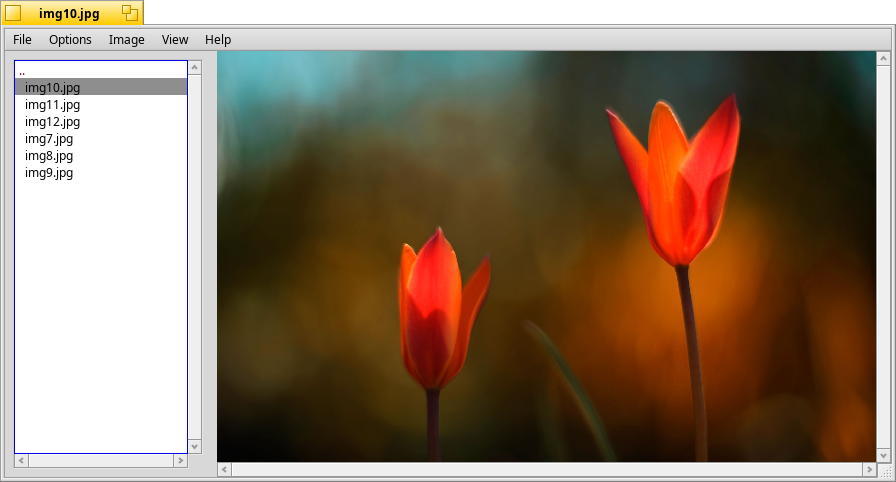

#  Peek

Free image browser and viewer with the aim of of being small, fast, efficient, very functional and intuitive.

I'd like to thank all those people who voted for this application and all those who keep giving me feedback. I really appreciate it.

Some info about Peek:

  *  Wheel mouse support.
  *  Support for multiple languages. (currently limited)
  *  Screen snapshots.
  *  Full drag and drop support.
  *  Clipping and area selection.
  *  Slideshow function.
  *  Configurable mouse mapping.
  *  Configurable drag and drop.
  *  Desktop background manipulation.

## SOME THINGS THAT CAN HELP

*PEEK CRASHES ON STARTUP*

If Peek crashes immediately on startup, try deleting the Peek settings file
in your ~/config/settings directory.  It's called "Peek_settings".  There may
be other Peek_settings files with random letters attached to the name. These
are SAFE to delete.  They are probably created when Peek crashes during a
'settings save'. and they contain only temporary information. They're not 
important.

*PEEK CRASHES TRACKER ON SHUTDOWN*

I've noticed that this occasionally happens to my version of OpenTracker 
whenever I have the ~/config/settings open and I'm closing Peek.  This is 
because there's quite a lot of file read/write/creates happening at that
time and OpenTracker freaks out a bit thanks to node_watching.
If this has happenend to you and your ~/config/settings folder has NOT been
open, please email me and tell me that it did happen to you.
In the mean time, I'm going to fix that.

*WHY DID I CHANGE THE LICENSE*

I've come to notice that the GPL doesn't protect any intellectual property
that secondary or further developers put into the code;  they have to give you
their source code if you want it. 
So the license has been changed to a "modified BSD" version.  You can change
what you like and then sell or distribute your version without worrying about 
source code, etc.
